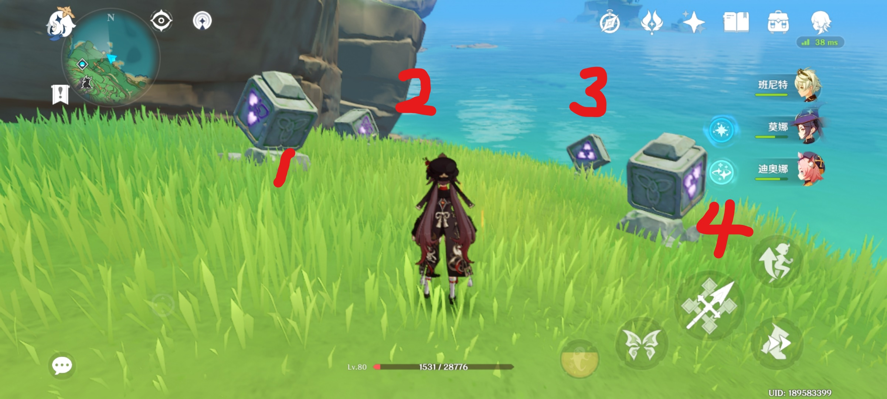
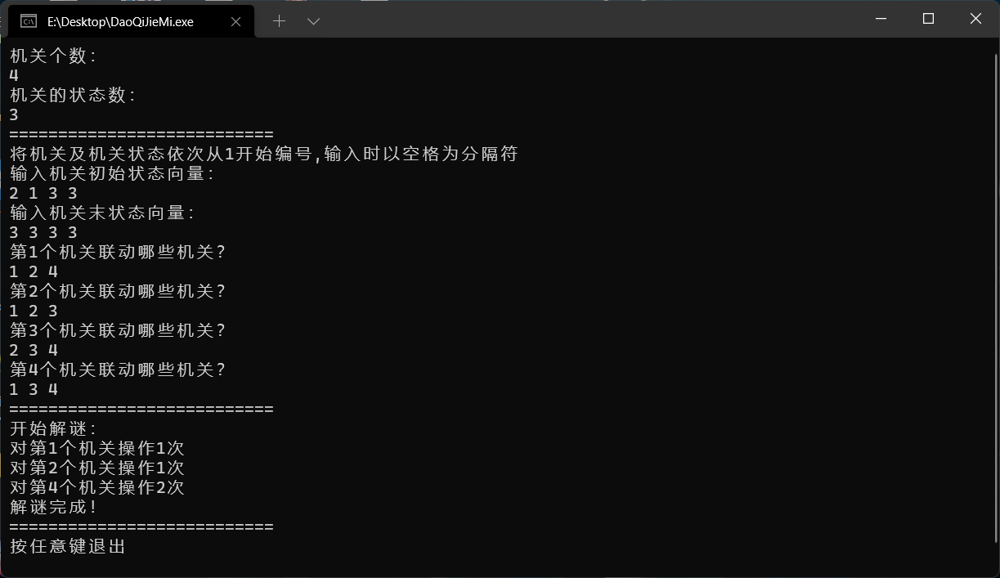

# DaoQiJieMi
原神稻妻雷方块机关求解器基于线性代数相关知识，可以在自己无聊的时候解着玩~

## 相关依赖

> 本项目核心计算由[Eigen](https://eigen.tuxfamily.org/index.php?title=Main_Page)支持，[Eigen](https://eigen.tuxfamily.org/index.php?title=Main_Page)是可以用来进行线性代数、矩阵、向量操作等运算的高级C++模板头文件库，包括线性代数，矩阵，向量操作，数值解决和其他相关的算法。

## 安装方法

自行下载上述依赖库并添加进工程，编译后即可食用（控制台黑框程序）

## 使用方法

1. 对机关进行编号如下图，共有**4**个机关；
2. 每个机关有**三种状态**：亮1灯、亮2灯、亮3灯（分别记作1,2,3，那么该机关初始状态为2,1,3,3）
3. 根据试验：击打1则2,4跟随变化，击打2则1,3跟随变化，以此类推。。。

4. 则根据以上分析有如下求解输入：

5. 解决！

